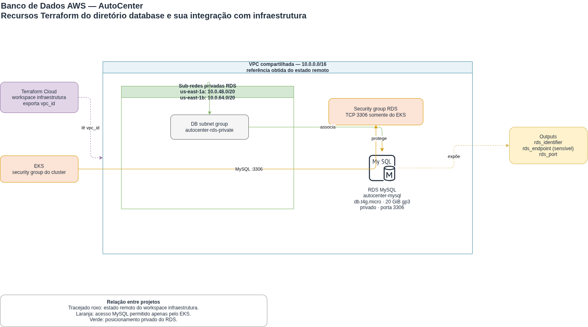

# Banco de Dados AutoCenter

Infraestrutura MySQL em Amazon RDS provisionada com Terraform. Este projeto
cria sub-redes privadas, o grupo de segurança do banco e uma instância RDS.

## Arquitetura



O desenho em [arquitetura.drawio](./arquitetura.drawio) mostra os recursos deste
diretório e sua relação com a infraestrutura compartilhada.

| Componente | Configuração |
| --- | --- |
| Estado remoto | Lê o `vpc_id` do workspace `infraestrutura` na organização `autocenter-fiap`. |
| Sub-redes RDS | Duas sub-redes privadas: `10.0.48.0/20` e `10.0.64.0/20`. |
| Zonas de disponibilidade | `us-east-1a` e `us-east-1b`. |
| Grupo de sub-redes | `autocenter-rds-private`, formado pelas duas sub-redes privadas. |
| Security group | Permite somente TCP `3306` a partir do security group do cluster EKS. |
| RDS | MySQL `db.t4g.micro`, 20 GiB `gp3`, sem acesso público. |

## Relação com a infraestrutura

Este projeto depende do workspace `infraestrutura` do Terraform Cloud:

1. o estado remoto fornece o `vpc_id` usado pelas sub-redes privadas e pelo
   security group do RDS;
2. a consulta ao EKS obtém o security group do cluster;
3. o RDS permite conexões MySQL na porta `3306` exclusivamente desse security
   group.

O diagrama `../infraestrutura/arquitetura.drawio` descreve a origem da VPC e do
EKS. Este diagrama detalha os recursos adicionais do banco dentro da mesma VPC.

## Pré-requisitos

- Terraform `>= 1.15.0`;
- credenciais AWS com permissões para criar recursos de rede e RDS;
- acesso à organização `autocenter-fiap` no Terraform Cloud;
- workspace `infraestrutura` disponível na mesma organização;
- valores sensíveis configurados no workspace `database`.

## Providers e estado

| Item | Configuração |
| --- | --- |
| Provider AWS | `hashicorp/aws ~> 6.0` |
| Região | `us-east-1` por padrão |
| Workspace Terraform Cloud | `database` |
| Estado remoto consumido | workspace `infraestrutura` |

## Variáveis

| Variável | Sensível | Valor padrão / requisito |
| --- | --- | --- |
| `aws_region` | Não | `us-east-1` |
| `db_name` | Não | Obrigatória; inicia com letra e aceita até 64 caracteres alfanuméricos ou `_`. |
| `db_username` | Sim | Obrigatória; inicia com letra e aceita até 16 caracteres alfanuméricos ou `_`. |
| `db_password` | Sim | Obrigatória. |
| `private_subnet_cidrs` | Não | `10.0.48.0/20`, `10.0.64.0/20` |
| `availability_zones` | Não | `us-east-1a`, `us-east-1b` |

Configure `db_name`, `db_username` e `db_password` como variáveis Terraform
no workspace `database`. Não crie nem versione `terraform.tfvars`.

## Uso

Inicialize e valide localmente:

```bash
terraform init
terraform fmt -check
terraform validate
terraform test
```

Em seguida, crie um plano no workspace `database` do Terraform Cloud, revise os
recursos e aprove o apply somente após a revisão humana do plano.

## Configuração do RDS

| Propriedade | Valor |
| --- | --- |
| Engine | MySQL |
| Identificador | `autocenter-mysql` |
| Classe | `db.t4g.micro` |
| Armazenamento | 20 GiB `gp3` |
| Porta | `3306` |
| Acesso público | Desabilitado |
| Multi-AZ | Desabilitado |
| Retenção de backup | 0 dias |
| Proteção contra exclusão | Desabilitada |

## Saídas

| Output | Sensível | Observação |
| --- | --- | --- |
| `rds_identifier` | Não | Identificador da instância RDS. |
| `rds_endpoint` | Sim | Endpoint do banco. |
| `rds_port` | Não | Porta MySQL configurada. |
| `rds_security_group_id` | Não | ID do security group do RDS MySQL. |
| `db_user` | Sim | Usuário administrativo do RDS MySQL. |

## CI/CD

Este repositório usa GitHub Actions. O workflow executa `terraform fmt -check` e
`terraform validate` em todo pull request aberto contra as branches `main` e
`develop`. O apply é realizado exclusivamente pelo Terraform Cloud após revisão
humana do plano.

**Regras de proteção de branch:**

- `main` e `develop` têm push direto bloqueado;
- todo merge exige aprovação por pull request.
